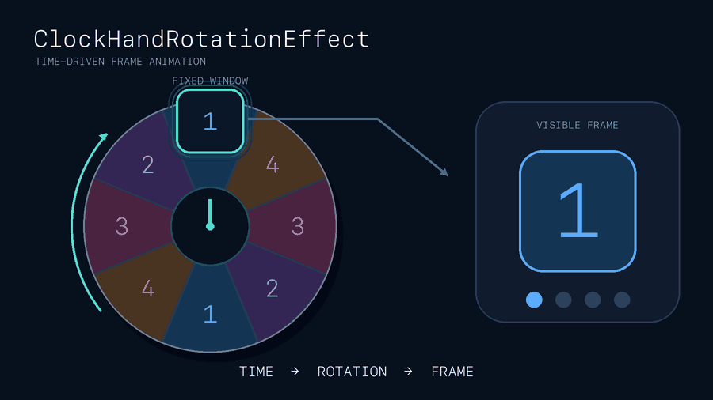

**English** · [한국어](README.ko.md)

# ClockHandKit

> [!CAUTION]
> ClockHandKit uses a private WidgetKit API.
> It may change without notice,
> and apps using it may not pass App Review.

**ClockHandKit** helps you build **continuous, time-driven animations**
in iOS Home Screen widgets.

Apple uses the same effect in its Clock widget but does not expose it as a
public API.
**ClockHandKit** directly accesses WidgetKit's private
`_ClockHandRotationEffect` modifier.

## How it works

WidgetKit normally refreshes **static timeline snapshots** at times chosen by
the system. [Public widget animations](https://developer.apple.com/documentation/widgetkit/animating-data-updates-in-widgets-and-live-activities)
are short transitions triggered by data updates, and they last at most two
seconds.

The standard timeline mechanism therefore cannot produce continuous,
frame-by-frame animation.

`ClockHandRotationEffect` works differently. Instead of waiting for a new
timeline snapshot, it keeps rotating a View inside WidgetKit based on the
current time.

Place multiple animation frames around a circular wheel and reveal one frame
through a fixed viewport. As the wheel rotates, the frames appear in sequence
and look like an animation.



**ClockHandKit applies this rotation effect to third-party widgets.**
Your app builds the frame wheel and fixed viewport.

## Usage and examples

The GIF above uses eight slots—frames `1` through `4` repeated twice.
This example rotates an app-defined frame wheel once every eight seconds:

```swift
import SwiftUI
import ClockHandKit

// A frame wheel built by your app with eight slots
frameWheel
    .clockHandRotationEffect(period: .custom(8))
```

Eight slots complete a rotation in eight seconds, so the next slot appears
once per second and the four-frame sequence repeats every four seconds.

`period` is not the duration of a single frame. It is
**the time required for one full 360° rotation**.

```text
period = total frame slots / target FPS
```

For one copy of a 120-frame sequence arranged around the wheel:

| Target rate | `period` |
| ---: | ---: |
| 12 FPS | 10 seconds |
| 24 FPS | 5 seconds |
| 30 FPS | 4 seconds |
| 60 FPS | 2 seconds |

Use `.hourHand`, `.minuteHand`, or `.secondHand` for clock hands, and
`.custom(seconds)` for frame animation.

Set the time zone and rotation anchor with `in` and `anchor`, respectively.
These values describe target timing; WidgetKit controls the actual rendering
cadence.

<!-- Add the standalone example repository and real-device playback samples here. -->

## Why ClockHandKit exists

[ClockHandRotationKit](https://github.com/octree/ClockHandRotationKit)
worked as expected through Xcode 26.0.1.

When a third-party widget linked against the iOS SDK from Xcode 26.1 ran on
iOS 26.1 or later, it still built successfully, but the **rotation effect was
no longer applied**.

Investigation showed that WidgetKit added a runtime gate based on the linked
SDK and the app's bundle identifier. For affected third-party apps, the private
entry point returns the original View without applying its modifier.

This is a **WidgetKit runtime restriction**, not a Swift-version mismatch or a
change to the JSON payload format.

ClockHandKit avoids the restricted entry point by constructing and applying
the underlying modifier directly.

### Validation

- ClockHandKit package builds: Xcode 26.1, 26.4, and 26.5
- Example app and both Widget Extensions: Xcode 26.5
- Runtime modifier bridge: iOS 26.1 and iOS 26.5 Simulators
- Original entry-point cross-check: `SDK 26.0 → iOS 26.1` and
  `SDK 26.1 → iOS 26.0` work; only the third-party
  `SDK 26.1 → iOS 26.1` combination fails
- ClockHandRotationKit 1.0.0, 1.0.1, and 1.1.0 × Xcode 26.0.1, 26.1.1,
  and 26.5 × iOS arm64 and Simulator arm64/x86_64 × Debug and Release:
  **all 54 combinations compiled and linked**

Because all 54 combinations built successfully, the regression was isolated
to runtime behavior rather than compilation or linking.

Further reading:

- [Original iOS 26.1 compatibility report](https://github.com/octree/ClockHandRotationKit/issues/11)
- [WidgetKit binary diff](https://github.com/blacktop/ipsw-diffs/blob/809573f26c4185c71fc786fb9adadab06c50ad0f/26_1_23B5044l__vs_26_1_23B5059e/DYLIBS/WidgetKit.md#L280-L304)

## Migrating from ClockHandRotationKit

Replace the import:

```diff
-import ClockHandRotationKit
+import ClockHandKit
```

ClockHandKit provides a `TimeInterval` overload for source-compatible
migration:

```swift
.clockHandRotationEffect(period: 60)
```

The typed API is recommended for new code:

```swift
.clockHandRotationEffect(period: .secondHand)
```

ClockHandRotationKit declares iOS 14, but ClockHandKit requires iOS 16 or later.

Do not import both modules into the same target.
Their extension methods may conflict.

## Acknowledgements ❤️

ClockHandKit was inspired by
[octree/ClockHandRotationKit](https://github.com/octree/ClockHandRotationKit),
a project I contributed to as a collaborator.

My heartfelt thanks to **octree** for open-sourcing the original implementation
and API that made this work possible. ❤️

## License

ClockHandKit is available under the [MIT License](LICENSE).
