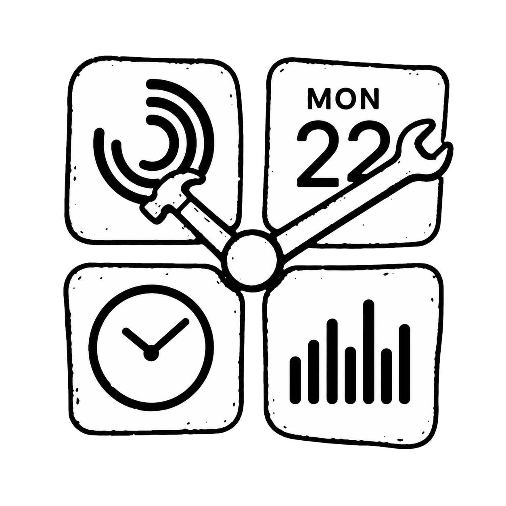

<p align="center">
  
</p>

<h1 align="center">ClockHandKit</h1>

<p align="center">
  <em>Continuous, time-driven animations for iOS Home Screen widgets.</em>
</p>

<p align="center">
  <a href="https://github.com/giljihun/ClockHandKit/stargazers"></a>
  <a href="https://github.com/giljihun/ClockHandKit/releases/latest"></a>
  <a href="Package.swift"></a>
  <a href="Package.swift"></a>
  <a href="Package.swift"></a>
  <a href="LICENSE"></a>
</p>

<p align="center">
  <sub><strong>English</strong> · <a href="README.ko.md">한국어</a></sub>
</p>

---

> [!CAUTION]
> ClockHandKit uses a private WidgetKit API.
> It may change without notice.
> Apps using it may not pass App Review.

Apple uses the same effect in its Clock widget.
It doesn't expose the effect as a public API.

**ClockHandKit** directly accesses a private WidgetKit modifier:
`_ClockHandRotationEffect`.

## How it works

WidgetKit normally refreshes **static timeline snapshots** on a system-controlled schedule.

[Public widget animations][widget-animations] run when widget data changes.
They are short transitions that last at most two seconds.

The standard timeline mechanism can't produce continuous frame-by-frame animation.

`ClockHandRotationEffect` works differently.
It rotates a View inside WidgetKit according to the current time.
It doesn't wait for a new timeline snapshot.

Place multiple animation frames around a circular wheel.
Keep a viewport fixed so that it reveals only one frame.
As the wheel rotates, the frames appear in sequence and look like an animation.


**ClockHandKit applies this rotation effect to third-party widgets.**
Your app builds the frame wheel and fixed viewport.

## Usage and examples

The GIF above uses eight slots.
Frames `1` through `4` appear twice.

The following code rotates an app-defined frame wheel once every eight seconds:

```swift
import SwiftUI
import ClockHandKit

// A frame wheel built by your app with eight slots
frameWheel
    .clockHandRotationEffect(period: .custom(8))
```

Eight slots complete one rotation in eight seconds.
The next slot appears once per second.
The four-frame sequence repeats every four seconds.

`period` is not the duration of a single frame.
It is **the time required for one full 360° rotation**.

```text
period = total frame slots / target FPS
```

For one copy of a 120-frame sequence:

| Target rate | `period` |
| ---: | ---: |
| 12 FPS | 10 seconds |
| 24 FPS | 5 seconds |
| 30 FPS | 4 seconds |
| 60 FPS | 2 seconds |

Use `.hourHand`, `.minuteHand`, or `.secondHand` for clock hands.
Use `.custom(seconds)` for frame animation.

Set the time zone with `in`.
Set the rotation anchor with `anchor`.

The table shows target timing.
WidgetKit and the device determine the actual rendering cadence.

<!-- Add the standalone example repository and real-device playback samples here. -->

## Why ClockHandKit exists

Apps using [ClockHandRotationKit][clockhand-rotation-kit] worked when built with Xcode 26.0.1.
Those builds also worked in the tested iOS 26.1+ environments.

The rotation effect wasn't applied when a third-party app built with
**Xcode 26.1 or later** ran on **iOS 26.1 or later**.
The app still **compiled and linked successfully**.

Investigation showed that WidgetKit added a runtime gate.
The gate checks the linked SDK and the app's bundle identifier.
For affected third-party apps, the private entry point returns the original View.
It doesn't apply the modifier.

This is a **WidgetKit runtime restriction**.
It isn't a Swift-version mismatch or a change to the JSON payload format.

ClockHandKit avoids the restricted entry point.
It constructs and applies the underlying modifier directly.

### Validation

- **ClockHandKit package builds**
  - Xcode 26.1, 26.4, and 26.5
- **Example app and both Widget Extensions**
  - Xcode 26.5
- **Runtime modifier bridge**
  - iOS 26.1 and iOS 26.5 Simulators
- **Original entry-point cross-check**
  - `SDK 26.0 → iOS 26.1`: works
  - `SDK 26.1 → iOS 26.0`: works
  - `SDK 26.1 → iOS 26.1`, third-party app: fails
- **ClockHandRotationKit compile/link matrix**
  - Releases: 1.0.0, 1.0.1, and 1.1.0
  - Xcode: 26.0.1, 26.1.1, and 26.5
  - Targets: iOS arm64, Simulator arm64, and Simulator x86_64
  - Configurations: Debug and Release
  - Result: **all 54 combinations compiled and linked**

All 54 combinations built successfully.
This isolates the regression to runtime behavior.
It wasn't a compilation or linking failure.

Further reading:

- [Original iOS 26.1 compatibility report][compatibility-report]
- [WidgetKit binary diff][widgetkit-binary-diff]

## Migrating from ClockHandRotationKit

Replace the import:

```diff
-import ClockHandRotationKit
+import ClockHandKit
```

ClockHandKit provides a `TimeInterval` overload for source-compatible migration:

```swift
.clockHandRotationEffect(period: 60)
```

The typed API is recommended for new code:

```swift
.clockHandRotationEffect(period: .secondHand)
```

ClockHandRotationKit declares iOS 14.
ClockHandKit requires iOS 16 or later.

Do not import both modules into the same target.
Their extension methods may conflict.

## Acknowledgements ❤️

ClockHandKit was inspired by [octree/ClockHandRotationKit][clockhand-rotation-kit].
I contributed to that project as a collaborator.

My heartfelt thanks to **octree** for open-sourcing the original implementation and API.
This work began there. ❤️

## License

ClockHandKit is available under the [MIT License](LICENSE).

[widget-animations]: https://developer.apple.com/documentation/widgetkit/animating-data-updates-in-widgets-and-live-activities
[clockhand-rotation-kit]: https://github.com/octree/ClockHandRotationKit
[compatibility-report]: https://github.com/octree/ClockHandRotationKit/issues/11
[widgetkit-binary-diff]: https://github.com/blacktop/ipsw-diffs/blob/809573f26c4185c71fc786fb9adadab06c50ad0f/26_1_23B5044l__vs_26_1_23B5059e/DYLIBS/WidgetKit.md#L280-L304
