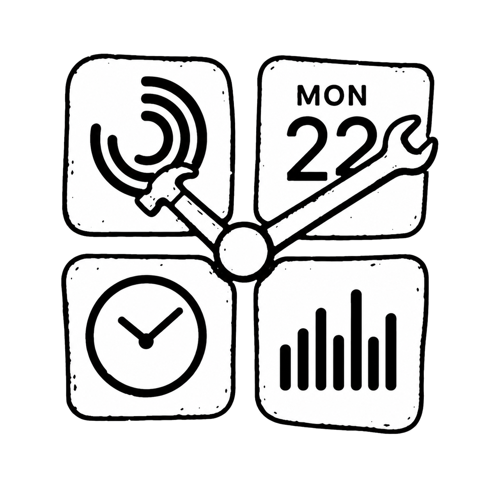
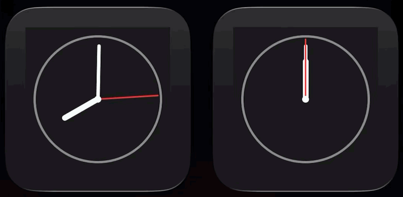
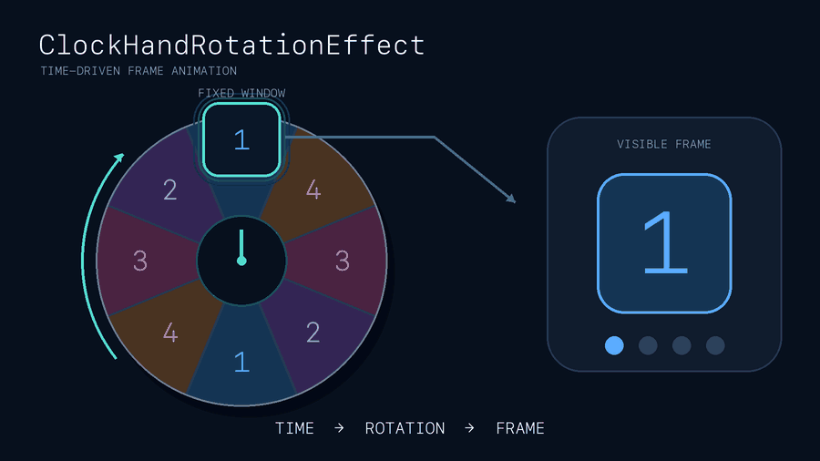

<p align="center">
  
</p>

<h1 align="center">ClockHandKit</h1>

<p align="center">
  <em>A framework for continuous animation in iOS widgets.</em>
</p>

<p align="center">
  <a href="https://github.com/giljihun/ClockHandKit/stargazers"></a>
  <a href="https://github.com/giljihun/ClockHandKit/releases/latest"></a>
  <a href="Package.swift"></a>
  <a href="Package.swift"></a>
  <a href="Package.swift"></a>
  <a href="LICENSE"></a>
</p>

<p align="center">
  <sub><strong>English</strong> · <a href="README.ko.md">한국어</a></sub>
</p>

---

Apple turns the hands of its Clock widget with `_ClockHandRotationEffect`. But it's a private WidgetKit API, so other apps don't get it.
**ClockHandKit** builds this effect at runtime and applies it, so widgets in your own apps can use it too.

> [ClockHandRotationKit](https://github.com/octree/ClockHandRotationKit) used to do the same thing, but it stopped working in apps built with Xcode 26.1 or later on iOS 26.1.
> So I made a new library that works around it. 😆
>
> See the [release notes](https://github.com/giljihun/ClockHandKit/releases) for details.

<p align="center">
  
</p>

<p align="center">
  <sub><strong>Left</strong>: ClockHandKit<br><strong>Right</strong>: the original ClockHandRotationKit on iOS 26.1 and later</sub>
</p>

## Installation

### Swift Package Manager

```swift
.package(url: "https://github.com/giljihun/ClockHandKit.git", from: "0.1.2")
```

## Usage and how it works

```swift
import SwiftUI
import ClockHandKit

ZStack {
    hourHand.clockHandRotationEffect(period: .hourHand)
    minuteHand.clockHandRotationEffect(period: .minuteHand)
    secondHand.clockHandRotationEffect(period: .secondHand)
}
```

Set the time zone with `in` and the pivot with `anchor`.

```swift
secondHand.clockHandRotationEffect(period: .secondHand, in: .gmt, anchor: .bottom)
```

### Frame animation

The effect turns a view by the current time, without waiting for a new timeline entry.
Place frames around a wheel and show one slot at a time through a fixed viewport. As the wheel turns, the frames play like an animation.



```swift
// A frame wheel built by your app with eight slots
frameWheel
    .clockHandRotationEffect(period: .custom(8))
```

`period` is the time for one full 360° turn, not the length of a single frame.

```text
period = total frame slots / target FPS
```

For one copy of a 120-frame sequence:

| Target rate | `period` |
| ---: | ---: |
| 12 FPS | 10 seconds |
| 24 FPS | 5 seconds |
| 30 FPS | 4 seconds |
| 60 FPS | 2 seconds |

These are targets. WidgetKit and the device decide the actual rendering cadence.

### Example

`Examples/ClockHandExample` contains an app with a clock widget.

## Migrating from ClockHandRotationKit

Replace the import.

```diff
-import ClockHandRotationKit
+import ClockHandKit
```

Existing calls such as `.clockHandRotationEffect(period: 60)` keep working.
For new code, the typed API reads better: `.clockHandRotationEffect(period: .secondHand)`.

ClockHandKit requires iOS 16 or later. Don't import both modules into the same target, because their extension methods can conflict.

## Acknowledgements ❤️

ClockHandKit started from [octree/ClockHandRotationKit](https://github.com/octree/ClockHandRotationKit), which I contributed to as a collaborator.
My heartfelt thanks to **octree** for all the inspiration. ❤️

## License

ClockHandKit is available under the [MIT License](LICENSE).
